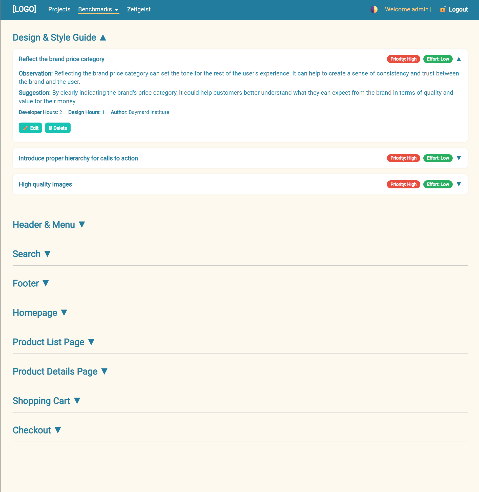

# CRO Auditing Tool

CRO Audit Automation turns conversion-rate optimization research into an actionable workflow.  
The app lets you register new client projects, curate a benchmark library, run interactive audits on live sites, and deliver a shareable review package — all from the browser.

> 💡 This README is intended as a **showcase**. Screenshots and GIFs illustrate the workflow and functionality. The source code and setup remain private.

---

## 🚀 Overview
- Built with **Flask**, **vanilla JavaScript**, and **SQLite** — lightweight and easy to host.  
- Bundled **Manifest V3 Chrome extension** overlays the audit checklist on any website.  
- Authentication handled by a dedicated **submodule** (`flask_login_blueprint`) for reusability.  
- Designed for **solo consultants** or **small teams** who want audit rigor without enterprise tooling.  

---

## 🖼 Feature Tour  

### 🔐 Authentication & Access Control
- Secure login with salted password hashing and session protection.  
- `login_required` decorator guards all routes.  
- Managed as a **git submodule** for modular, reusable authentication.  

---

### 📂 Project Intake & Management
- Capture company info, industries, authors, and PNG logos.  
- Support **Full Audit** (all chapters) or **Specific Audit** (custom checklists).  
- Dashboard lists audits with **Start / Continue / Review** actions.  
- Audit status persists (`not_started`, `in_progress`, `completed`).  

---

### 📚 Benchmark Knowledge Base
- Bulk import suggestions from CSV.  
- Add suggestions manually with drag-and-drop image uploads and metadata (device, industry, URL).  
- Inline edit & delete for quick updates.  
- Lightbox previews to showcase examples.  

---

### 🖥 Audit Overlay & Progress Tracking
- Chrome extension injects an overlay panel (`/overlay/<project_id>`) on live sites.  
- Checkboxes sync in real time with the backend to track suggestion adoption.  
- Chapters ordered to match audit flow (e.g. Checkout at the end).  

---

### 📊 Reporting & Client Handoffs
- Review page shows project metadata, benchmarks, and completion stats.  
- Excel export provides suggestion logs with dropdowns and hour rollups.  
- Easy to hand off to clients as deliverables.  

---

### 🛠 Developer Experience & UX Extras
- Theme toggle (light/dark) with local storage persistence.  
- Reusable modal system and structured chapter toggles.  
- Image management with metadata stored in SQLite.  

---

## 🏗 Architecture at a Glance
cro-audit-automation/
├── routes/                 # Blueprints for projects, benchmarks, suggestions, reports
├── services/               # Database service layer
├── templates/              # Jinja templates for dashboard, overlays, reports
├── static/                 # CSS/JS for modals, uploads, theme support
├── uploads/                # Company logos
├── cro-audit-extension/    # Chrome extension (popup, overlay, background script)
└── flask_login_blueprint/  # Git submodule for reusable auth stack

---

## 🔄 Typical Audit Workflow
1. Log in and create a client project.  
2. Build/import the benchmark library with screenshots.  
3. Inject overlay on the client’s site and mark off suggestions.  
4. Review progress in the dashboard and export deliverables.  

---

## 🗺 Roadmap (Concepts)
- Zeitgeist dashboard with adoption analytics across clients.  
- Role-based permissions and audit logging.  
- Cloud storage (S3/GCS) for screenshots.  
- PDF export and client portals.
- Google Slides for Presentations

---

👉 **Note:** This README is a **visual portfolio**. Source code is private — reach out if you’d like a guided demo.  
